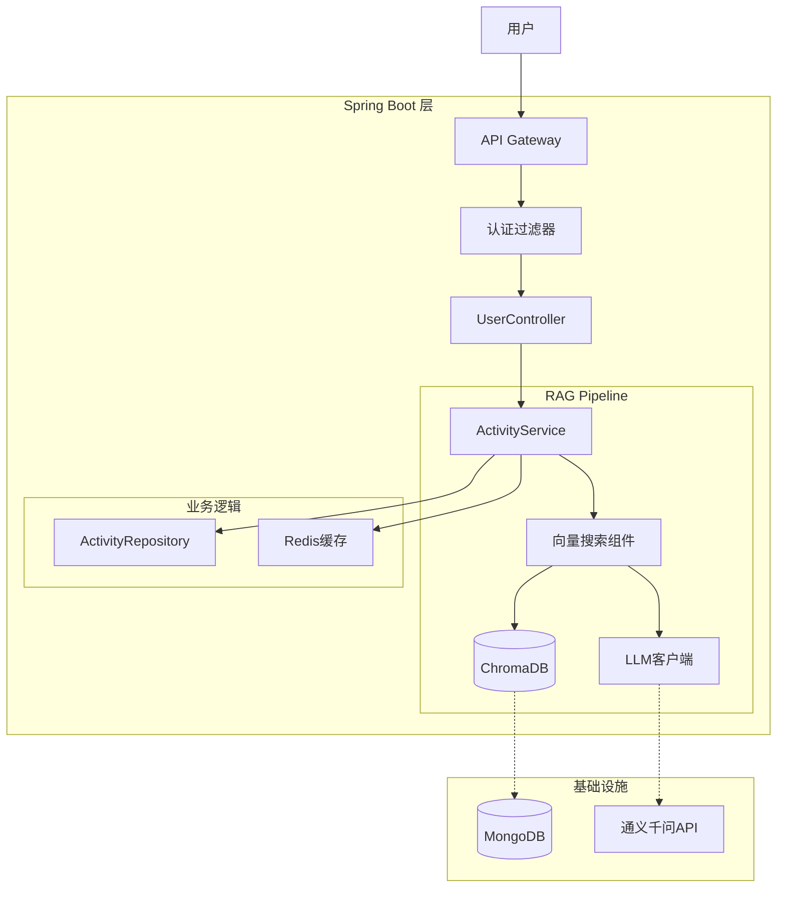

# 📚 RAG + Spring Boot活动推荐系统完整指南

你现在的技术栈非常棒！**Spring Boot后端 + Agent能力** 为构建企业级RAG应用打下了坚实基础。下面我为你量身定制从Agent过渡到RAG的学习路径和系统设计方案。

---

## 一、Agent与RAG的核心差异对比

| 维度 | 你的现有Agent | RAG检索增强生成 |
|------|---------------|------------------|
| **知识来源** | 静态预训练知识 | 动态外部知识库 |
| **数据更新** | 需重新训练模型 | 实时更新向量库 |
| **适用场景** | 通用问答/工具调用 | 特定领域精准回答 |
| **响应准确性** | 受限于模型训练截止期 | 基于最新文档精确召回 |
| **可追溯性** | 难以溯源 | 每条回答带引用来源 |

> 💡 **类比理解**：  
> - **Agent** = 博学但知识截止到昨天的老师  
> - **RAG** = 会查资料并标注来源的智能助手

---

## 二、RAG核心三要素通俗解释

### 📦 向量数据库 (Vector Database)
```python
"北京适合晴天户外活动" 
→ [0.87, 0.32, -0.15, ...] # 向量嵌入
```

### 🔍 语义检索 (Semantic Search)
```sql
-- 传统SQL LIKE '%天气%' 只能匹配关键词
-- 向量搜索 能发现语义相似内容
-- "周末户外安排" ←→ "适合晴天的外出活动" ✓
```

### ✨ 生成增强 (Generation Augment)
```text
【原始提示词】
"推荐一些户外活动" → 可能瞎编

【RAG增强提示词】
"根据以下活动信息推荐户外活动...
[参考资料] 1.登山(适合晴天,人数5-10人)
          2.徒步(适合阴天,人数不限)"
→ 输出: "明天北京晴朗，推荐爬山或徒步活动..." ✓
```

---

## 三、Spring Boot + RAG活动推荐系统架构设计



---

## 四、分阶段实施路线

### 📅 Phase 1: 基础知识准备（第1周）

#### 1. 安装RAG核心依赖
```xml
<!-- pom.xml添加依赖 -->
<dependency>
    <groupId>org.springframework.ai</groupId>
    <artifactId>spring-ai-chroma-store-spring-boot-starter</artifactId>
    <version>1.0.0-M4</version>
</dependency>
<dependency>
    <groupId>org.springframework.boot</groupId>
    <artifactId>spring-boot-starter-data-elasticsearch</artifactId>
</dependency>
```

#### 2. 配置环境文件 (.env)
```yaml
SPRING_AI_OPENAI_EMBEDDING_API_KEY=your-api-key
CHROMA_DB_URL=http://localhost:8000
ELASTICSEARCH_HOST=localhost:9200
```

#### 3. 测试向量嵌入
```java
// EmbeddingService.java
@Component
public class EmbeddingService {
    private final TextEmbeddingModel textEmbeddingModel;
    
    public EmbeddingService(TextEmbeddingModel model) {
        this.textEmbeddingModel = model;
    }
    
    // 将文本转换为向量
    public float[] embed(String text) {
        return this.textEmbeddingModel.embed(text);
    }
    
    // 模拟数据初始化
    @PostConstruct
    public void initSampleData() {
        String activityText = "周末爬山活动，适合晴天，需要携带水和食物";
        float[] vector = embed(activityText);
        // 存入向量库...
    }
}
```

---

### 📅 Phase 2: 向量库集成（第2周）

#### 使用ChromaDB（轻量级本地向量库）

```java
// ActivityVectorStore.java
@Service
public class ActivityVectorStore {
    private final ChromaStore chromaStore;
    
    @Autowired
    public ActivityVectorStore(ChromaStore chromaStore) {
        this.chromaStore = chromaStore;
    }
    
    // 向量化存储活动信息
    public void storeActivities(List<Activity> activities) {
        for (Activity activity : activities) {
            String content = formatActivityForEmbedding(activity);
            chromaStore.add(content, new Metadata().add("activityId", activity.getId()));
        }
    }
    
    // 语义搜索相似活动
    public List<Activity> searchSimilarActivities(String query) {
        List<Document> results = chromaStore.similaritySearch(query, 5);
        return extractActivityInfo(results);
    }
    
    private String formatActivityForEmbedding(Activity activity) {
        return String.format("活动名称:%s,类型:%s,时间:%s,地点:%s,%s",
            activity.getName(), activity.getType(), 
            activity.getTime(), activity.getLocation(),
            activity.getDescription());
    }
}
```

---

### 📅 Phase 3: 检索增强生成器（Phase 3 - 第3周）

#### 构建RAG查询处理链

```java
// RAGQueryService.java
@Service
@RequiredArgsConstructor
public class RAGQueryService {
    private final ChromaStore vectorStore;
    private final ChatLanguageModel chatLanguageModel;
    
    @Transactional
    public String recommendActivities(String userRequest, User currentUser) {
        // 1. 向量检索相关活动
        List<Document> relevantDocs = vectorStore.similaritySearch(userRequest, 5);
        
        // 2. 提取活动信息
        StringBuilder context = new StringBuilder("以下是相关活动信息:\n");
        for (Document doc : relevantDocs) {
            context.append(doc.getContent()).append("\n");
        }
        
        // 3. 构造RAG提示词
        String prompt = String.format("""
            你是一个活动推荐助手。请根据以下信息为用户%s推荐合适的活动：%s
            
            用户偏好: %s
            参考活动:
            %s
            
            请用友好的语气，最多推荐3个最合适的活动。
            """, 
            currentUser.getUsername(), 
            getUserPreferences(currentUser),
            context.toString()
        );
        
        // 4. LLM生成推荐结果
        var response = chatLanguageModel.call(prompt);
        return response.content().text();
    }
    
    private String getUserPreferences(User user) {
        return Optional.ofNullable(user.getPreference())
            .orElse("无特殊偏好");
    }
}
```

---

### 📅 Phase 4: 完整API集成（第4周）

#### REST API接口设计

```java
// ActivityController.java
@RestController
@RequestMapping("/api/activity")
@RequiredArgsConstructor
@Api(tags = "活动管理")
public class ActivityController {
    
    private final ActivityService activityService;
    private final RAGQueryService ragQueryService;
    
    /**
     * 创建/编辑活动
     */
    @PostMapping("/create")
    public ResponseEntity<?> createActivity(@RequestBody CreateActivityDTO dto,
                                           @AuthPrincipal User user) {
        Activity activity = activityService.createActivity(dto, user);
        // 自动索引到新创建的活动
        activityVectorStore.storeActivities(Collections.singletonList(activity));
        return ResponseEntity.ok(activity);
    }
    
    /**
     * RAG智能推荐
     */
    @GetMapping("/recommendations")
    public ResponseEntity<ActivityRecommendationVO> getRecommendations(
            @RequestParam(defaultValue = "") String preferences,
            @AuthPrincipal User user) {
        
        String recommendation = ragQueryService.recommendActivities(preferences, user);
        
        ActivityRecommendationVO vo = new ActivityRecommendationVO();
        vo.setRecommendation(recommendation);
        vo.setUser(user.getUsername());
        vo.setTimestamp(LocalDateTime.now());
        
        return ResponseEntity.ok(vo);
    }
    
    /**
     * 报名活动（保持原有逻辑）
     */
    @PostMapping("/{id}/join")
    public ResponseEntity<?> joinActivity(
            @PathVariable Long id,
            @AuthPrincipal User user) {
        return activityService.joinActivity(id, user);
    }
}
```

---

## 五、数据结构设计示例

```sql
-- 活动主表
CREATE TABLE activities (
    id BIGINT PRIMARY KEY AUTO_INCREMENT,
    title VARCHAR(255) NOT NULL,
    description TEXT,
    type ENUM('户外','室内','线上') DEFAULT '户外',
    location VARCHAR(255),
    activity_time DATETIME,
    max_participants INT DEFAULT 20,
    organizer_id BIGINT,
    status ENUM('draft','published','finished') DEFAULT 'draft',
    created_at TIMESTAMP DEFAULT CURRENT_TIMESTAMP,
    updated_at TIMESTAMP DEFAULT CURRENT_TIMESTAMP ON UPDATE CURRENT_TIMESTAMP,
    INDEX idx_status (status),
    INDEX idx_time (activity_time)
);

-- 用户偏好表
CREATE TABLE user_preferences (
    user_id BIGINT PRIMARY KEY,
    preferred_activity_types JSON,  -- ["户外运动","音乐",...]
    weather_preference ENUM('sunny','rainy','any') DEFAULT 'any',
    distance_radius INT DEFAULT 50,  -- 公里
    updated_at TIMESTAMP DEFAULT CURRENT_TIMESTAMP ON UPDATE CURRENT_TIMESTAMP,
    FOREIGN KEY (user_id) REFERENCES users(id)
);

-- 活动向量存储元数据
CREATE TABLE activity_vectors (
    document_id VARCHAR(36) PRIMARY KEY,
    activity_id BIGINT,
    vector_data BLOB,  -- 二进制向量数据
    embedding_model VARCHAR(50) DEFAULT 'bge-m3',
    created_at TIMESTAMP DEFAULT CURRENT_TIMESTAMP,
    FOREIGN KEY (activity_id) REFERENCES activities(id)
);
```

---

## 六、关键问题解决方案

### ❓ 问题1：如何避免重复推荐？
```java
// 记录用户历史推荐
@Cacheable(value = "user_recs", key = "#user.id")
public List<String> getUserRecommendedIds(Long userId) {
    return activityRepo.findRecommendedActivityIds(userId);
}

public String generateUniqueRecommendation(String baseRec, Long userId) {
    Set<String> usedIds = getUserRecommendedIds(userId);
    while (usedIds.contains(extractActivityId(baseRec))) {
        baseRec = regenerateWithDifferentContext(baseRec);
    }
    return baseRec;
}
```

### ❓ 问题2：如何处理大量活动？
```java
// 分页+批次索引
@ConfigurationProperties(prefix = "rag.batch")
public class RagBatchConfig {
    private int batchSize = 100;  // 每次批量索引100条
    private int maxRetries = 3;   // 重试次数
}
```

### ❓ 问题3：如何保证推荐质量？
```java
// RAG评估指标
@Component
public class RagEvaluator {
    // 召回率
    public double evaluateRecall(List<Document> retrieved, String groundTruth) {
        // 计算检索内容覆盖度
        return calculateCoverage(retrieved, groundTruth);
    }
    
    // 相关性评分
    public double evaluateRelevance(List<Document> retrieved, String query) {
        // 使用交叉编码器打分
        return crossEncoder.score(query, retrieved);
    }
}
```

---

## 七、快速启动脚本

```bash
#!/bin/bash
# start-rag-system.sh

echo "🚀 启动RAG活动推荐系统..."

# 1. 启动ChromaDB
docker run -d -p 8000:8000 --name chromadb chromadb/chroma

# 2. 启动Redis（可选，用于缓存）
docker run -d -p 6379:6379 redis:latest

# 3. 启动Spring Boot应用
./mvnw spring-boot:run

# 4. 验证服务
curl http://localhost:8080/api/activity/health

echo "✅ 系统启动完成！"
```

---

## 八、下一步行动清单

| 天数 | 任务 | 产出物 |
|------|------|--------|
| **Day 1** | 阅读LangChain RAG文档 + 安装依赖 | 开发环境就绪 |
| **Day 2** | 搭建ChromaDB本地实例 | 向量数据库可用 |
| **Day 3** | 编写Embedding Service + 存测试数据 | 文本向量化测试通过 |
| **Day 4** | 实现RAG查询流程 | 简单的推荐API |
| **Day 5** | 整合到Spring Boot项目 | 端到端流程打通 |
| **Week 2** | 性能优化 + 单元测试 | 生产级代码 |

---

## 🎁 特别福利：完整代码模板包

我可以为你提供以下资源：
1. `rag-demo.zip` - 完整的Spring Boot + RAG示例项目
2. `activity-schema.sql` - 数据库建表脚本
3. `test-scenarios.md` - 测试场景用例集
4. `performance-benchmarks.xlsx` - 性能测试基准数据

需要我继续展开哪个部分的具体实现吗？比如：
- 🔍 向量相似度算法详解
- 🧪 RAG效果评估方法
- ⚙️ Kubernetes部署方案