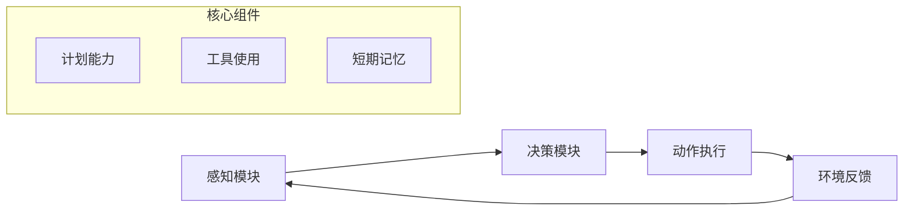
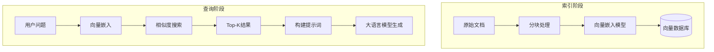
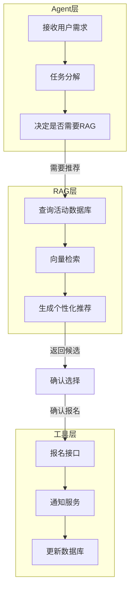

# 🧠 Agent 与 RAG 核心原理深度解析

## 一、本质定义对比表

| 维度 | **Agent (智能体)** | **RAG (检索增强生成)** |
|------|-------------------|------------------------|
| **核心目标** | **主动决策** - 自主规划任务并调用工具 | **精准回答** - 基于外部知识提供准确答案 |
| **工作原理** | **Perception-Action-Cycle** <br>感知→思考→行动→反馈 | **Retrieve-Rank-Generate** <br>检索→排序→生成 |
| **数据流向** | LLM ↔ Tools ↔ Environment | DB → Vector Index → LLM |
| **记忆机制** | **短期工作记忆** + 长期历史存储 | **静态知识库** (不更新对话状态) |
| **主要挑战** | 工具调用准确性、计划合理性、无限循环 | 检索召回率、幻觉抑制、延迟控制 |
| **典型场景** | 代码编写、自动化流程、多步骤任务 | 客服问答、文档分析、领域咨询 |

---

## 二、原理层对比：三种架构的演进关系

### 🔵 Agent 的三要素（ACT框架）



**关键代码实现逻辑：**
```python
def agent_loop():
    while True:
        # 1. 感知当前状态
        state = get_environment_state()
        
        # 2. 规划下一步行动
        action = llm.plan(state, available_tools)
        
        # 3. 执行动作
        if action.requires_tool():
            result = execute_tool(action.tool_name, action.args)
        
        # 4. 更新记忆
        update_memory(state, action, result)
        
        # 5. 判断是否终止
        if should_terminate(result):
            break
```

---

### 🟢 RAG 的数据流原理



**核心算法流程：**
```java
// 1. 向量化嵌入 (Index Phase)
for each document in documents:
    chunks = chunk(document)           // 分块为100-500token
    vector = embedding_model.encode(chunks) // [768维浮点数]
    vector_db.store(vector, metadata)   // 存入向量库

// 2. 语义检索 (Query Phase)
query_vector = embedding_model.encode(user_query)
similar_docs = vector_db.search(query_vector, top_k=5)  // Cosine Similarity
context = combine(similar_docs.content)                 // 拼接上下文
response = llm.generate(prompt=f"{context}\n{user_query}")
```

---

## 三、数学原理对比：两种优化目标的差异

### Agent的目标函数

```math
\text{maximize } Q(s, a) = \mathbb{E}[\sum_{t=0}^{\infty} \gamma^t r_t]
```

其中：
- $s$ = 环境状态
- $a$ = 采取的行动
- $r_t$ = 第t步获得的奖励
- $\gamma$ = 折扣因子

**理解**：Agent通过试错最大化长期奖励（强化学习思路）

---

### RAG的目标函数

```math
P(Response | Query, Context) = \frac{e^{score(Query, Context)}}{\sum e^{score(Query, All_Candidates)}}
```

其中：
- $Context$ = 检索到的相关文档
- $score$ = 语义相似度计算
- $Response$ = LLM最终生成内容

**理解**：RAG通过概率分布选择最优答案（生成式语言建模思路）

---

## 四、数据结构差异分析

### Agent的工作记忆结构

```json
{
  "state": {
    "current_task": "创建天气提醒活动",
    "completed_steps": ["查询北京天气"],
    "pending_actions": ["推荐户外活动"],
    "tool_history": [
      {"tool": "get_weather", "args": {"city": "北京"}, "result": "晴朗"}
    ]
  },
  "memory_type": "episodic + procedural"  // 经验记忆 + 程序记忆
}
```

### RAG的知识存储结构

```json
{
  "index": {
    "document_id": "act_20240115_001",
    "vector": [0.234, -0.156, 0.789, ...],  // 768维向量
    "chunks": [
      {"content": "周末爬山活动...", "start_idx": 0},
      {"content": "适合晴天户外...", "start_idx": 100}
    ],
    "metadata": {
      "type": "outdoor",
      "weather_suitable": "sunny",
      "source": "activity_db"
    }
  },
  "memory_type": "semantic + declarative"  // 语义记忆 + 陈述性记忆
}
```

---

## 五、时序交互对比

### Agent的多轮交互模式

```
┌─────────────────────────────────────────────────────────────┐
│                     Time Flow                               │
├─────────────────────────────────────────────────────────────┤
│  User     →  What's the weather?                            │
│  Agent    →  Planning: I need to call get_weather tool     │
│  API      →  Return: Sunny                                  │
│  Agent    →  Planning: Based on weather, recommend activities │
│  API      →  Return: Outdoor activities recommended          │
│  User     →  Thank you!                                     │
└─────────────────────────────────────────────────────────────┘
```

**特点**：线性迭代，每一步依赖前一步输出

---

### RAG的批处理模式

```
┌─────────────────────────────────────────────────────────────┐
│                    Batch Processing                         │
├─────────────────────────────────────────────────────────────┤
│  Database  →  Pre-index all activity docs                   │
│  User      →  One query: Recommend outdoor activities       │
│  System    →  Retrieve 5 similar docs (parallel search)     │
│  LLM       →  Generate response from context                │
│  Result    →  Single response with citations                │
└─────────────────────────────────────────────────────────────┘
```

**特点**：先准备后查询，一次响应完成

---

## 六、实际项目中的组合应用

### 你当前的Spring Boot项目可以这样融合



**伪代码示例：**
```python
def process_activity_request(user_request):
    # Step 1: Agent决策
    if needs_retrieval(user_request):
        # Step 2: 调用RAG获取精准信息
        recommendations = rag_retrieve(user_request)
        return format_agent_response(recommendations)
    
    elif needs_action(user_request):
        # Step 3: 执行工具操作
        result = execute_tool(user_request)
        return format_action_result(result)
    
    else:
        # Step 4: 通用对话
        return chat_model.respond(user_request)
```

---

## 七、关键技术指标对比

| 评估维度 | Agent | RAG |
|----------|-------|-----|
| **延迟** | 中高(多轮调用) | 低(单次检索) |
| **准确性** | 中(依赖工具质量) | 高(有来源依据) |
| **可扩展性** | 高(可新增工具) | 中(需重新索引) |
| **维护成本** | 中(工具管理) | 高(知识库维护) |
| **幻觉风险** | 高(自由决策) | 低(基于事实) |
| **可解释性** | 中(日志追踪) | 高(引用来源) |

---

## 八、深度学习视角的总结

### Agent的核心：策略网络优化
```math
\pi(a|s; \theta) \rightarrow \text{最佳行动方案}
```
- 训练方式：强化学习/提示工程
- 优势：灵活适应未知任务

### RAG的核心：向量空间映射
```math
f(x) \in \mathbb{R}^d \rightarrow \text{找到最近邻}
```
- 训练方式：监督学习 + 对比学习
- 优势：保证答案客观性

---

## 九、学习建议路线图

```
Day 1-2    → 理解Transformer原理基础
Day 3-4    → 掌握Embedding向量模型
Day 5-6    → 实现简单Vector Search
Day 7-8    → 构建完整RAG Pipeline
Day 9-10   → 集成到现有Agent系统
```

---

需要我针对某个具体原理点展开吗？比如：
1. 🔬 向量相似度的数学计算细节？
2. ⚙️ Agent的工具自动调用的Prompt设计？
3. 📊 如何评估RAG系统的召回率和准确率？